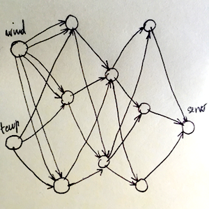

# EXNN 
_Evolutive Neural Networks framework à la G.Sher written in Elixir_

# Preliminary Notice
The work presented here is _strongly_ influenced
by the seminal book [Handbook of Neuroevolution Through Erlang](http://www.springer.com/de/book/9781461444626) by Gene I.Sher, which is a vast source of inspiring concepts and thoughts on the topic.

On the other hand I tried to give the whole system
a modular and configurable DSL-like approach exploiting Elixir macros and protocols,
as well as OTP application components.

# :construction: All this is quite still in progress :construction:

This library is in a very early stage, and it can at the moment only train a trivial _xor_ function. With some love and time, it will see some improvements. Contributions
are welcome, of course.

# Docs

I am slowly building an ex_doc [Documentation](http://zampino.github.io/exnn)
out of the code.

# Usage Instructions

To use EXNN you will first mix EXNN as dependency and then
push `EXNN.Supervisor` module into the stack
of your application's supevised children.

Your main application file
will also serve as configuration for customizing initial conditions
of the system:

### Configuration

```elixir

defmodule MyApp do
  use EXNN.Application

  sensor :temp, MyApp.TempSensor, dim: 1
  sensor :wind, MyApp.WindSensor, dim: 2
  actuator :servo, MyApp.WindowServo

  fitness MyApp.Fitness

  initial_pattern [
    sensor: [:temp, :wind],
    neuron: {3, 2, 3},
    actuator: [:servo]
  ]

  def start(_, _) do
    import Supervisor.Spec
    children = [
      supervisor(MyApp.MainSupervisor),
      # ... all these beautiful supervised boys
      supervisor(EXNN.Supervisor, [[config: __MODULE__]])
    ]

    Supervisor.start_link children, [strategy: :one_for_one]
  end
end

```
Note `EXNN.Application` is just a wrapper around Elixir/OTP `Application` module,
exposing the configuration DSL.

With `sensor` and `actuator` macros,
you can register sensor and actuator modules by name. For sensors
you have to specify the dimension of the signal vector.

With the `fitness` macro you register a fitness module wich will
compute in real time how much the present system is close to one (of the possible)
optimal configuration and topology.

`initial_pattern` decides the initial topology for your network, it's a
Keyword accepting the 3 keys above. You can only mention previously registered
sensors and actuators. The value for `neuron` key has to be a tuple denoting
the size of each neural layer you want your system to start with.
In the above example, the initial_pattern given would correspond to the digraph:



where all elements in a layer are connected to all vertices of the following.

### Sensors
Your sensor module will use `EXNN.Sensor`. At its heart is an OTP genserver.
You have to implement the function `sense/2` which is called when
`EXNN.Trainer` synchronizes all sensors in the system.

On the other hand,
since it's a genserver registered with its module name, you can reach it
from any external service providing sample data:

An optional `state` given to `use` accepts a keywork list to
feed initial conditions to the genserver state.
The state itself is a struct, named by your module's name.

```elixir
defmodule MyApp.TempSensor do
  use EXNN.Sensor, state: [outer_temp: 0]

  def sense(state, _metadata) do
    {state.outer_temp}
  end

  def handle_cast({:update_temp, value}, state) do
    {:noreply, %{state | outer_temp: value}}
  end
end

defmodule MyApp.WindSensor do
  use EXNN.Sensor, state: [speed: 0, direction: 0 * :math.pi]

  def sense(state, _meta) do
    {state.speed, state.direction}
  end

  # ...some callbacks to update state...
end
```

`sense/2` forwards the desired
signal to the front neuronal layer.
It takes the current state of the sensor and a tuple of scalar
values of the same length as the configured dimension.
Read more about sensors in the [docs](http://zampino.github.io/exnn)


### Actuators
Using `EXNN.Actuator` in your modules you can setup a genserver
which reacts to signals coming from the terminal neural layer.

You have to implement an `act/3` method which takes the current state,
a signal arrived from the neuronal layer and some metadata (more on
metadata later). `act/3` can have the side-effects you desire
and must return the modified state.
The message passed to `act/3` is a keywork list
`[n_id: v]` with a key `n_id` identifying the firing neuron,
and a scalar float value `v`.

```elixir
defmodule MyApp.WindowServo do
  use EXNN.Actuator, state: %{current: 0}

  def act(state, message, _metadata) do
    {:ok, new_val} = MyApp.WindowServo.Command.turn(message)
    %{state | current: new_val}
  end

end

```


### Fitness
A Fitness module evaluates how the system is performing in real-time,
it's your responsibility to implement an `eval/3` function taking the same
`message` passed to the actuator, the usual metadata and it's state.

The trainer will call eval in your module right after your
actuators have changed the environment so that it can measure
the effects actuators have introduced.

```elixir
defmodule MyApp.Fitness do
  use EXNN.Fitness, state: %{inner_temp: 0.0, outer_temp: 40.0}

  def eval(state, _message, _metadata) do
    diff = state.outer_temp - get_inner_temp
    fitness = 1/(1 + :math.pow(diff, 2))
    emit(fitness)
    state
  end

  def get_inner_temp do
    # ask inner temperature...
  end

end

```

# Examples
You can -- at present -- train a basic XOR problem by running:

```
mix test test/examples/xor_test.exs
```

# Core Concepts

- Sensors, Neuron and Actuators all live as GenServer processes registered with
  an identifier present in the underlying genome. They specialise an abstract
  `EXNN.NodeServer` and implement a `EXNN.Connection` protocol to forward signals
  between nodes.

- Fitness modules intercept signals from the final neural layer and evaluates
  and emit a fitness rank to the `EXNN.Trainer.Sync` which decides to mutate
  or revert the system to previous configuration.

- A _mutation semigroup_ takes care of altering the genomes and injecting live (and
  concurrently) new weights/bias specifications into neuronal genserver processes.
  Each mutation has an inverse mutation, which restores a single node to its previous
  state. The trainer keeps track of the changes in a mutation history.


# Future Plans

- Instrumentation for learning times and logging.

- Explorative search along mutation paths (see `EXNN.Trainer.Mutations`)
  to split an individuum into two or more (mutation + mitosis).

- Handle sync among a population of nets through routing with fixed sensors and actuators.

- Rewrite `EXNN.Trainer.Sync` as a `:gen_fsm` with states 'learning'/'production'.
  Switching to 'production' whenever fitness stably enters a tolerance
  neighborhood of 1.

# References

1. Gene.I.Sher, _Handbook of Neuroevolution Through Erlang_, 2013, Springer
